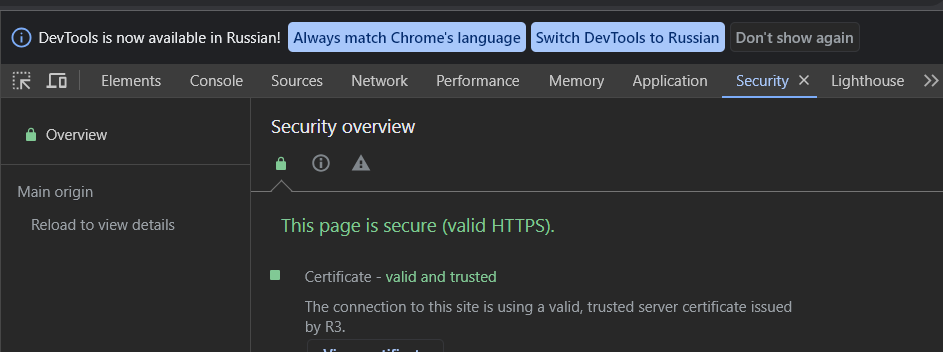
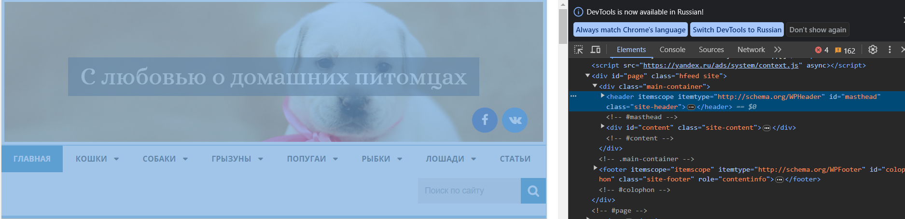
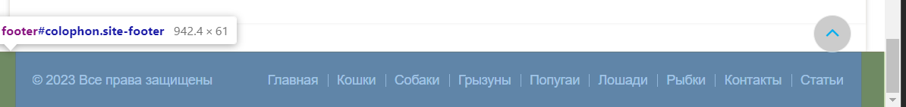
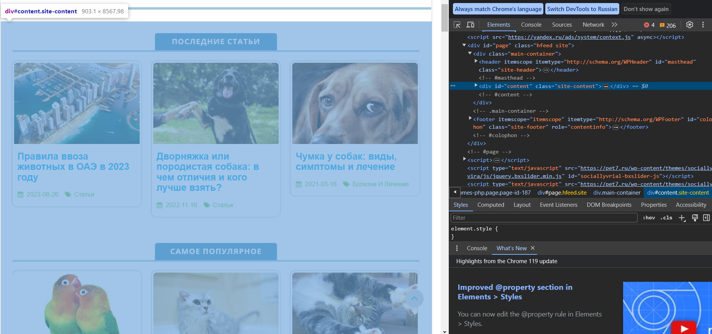
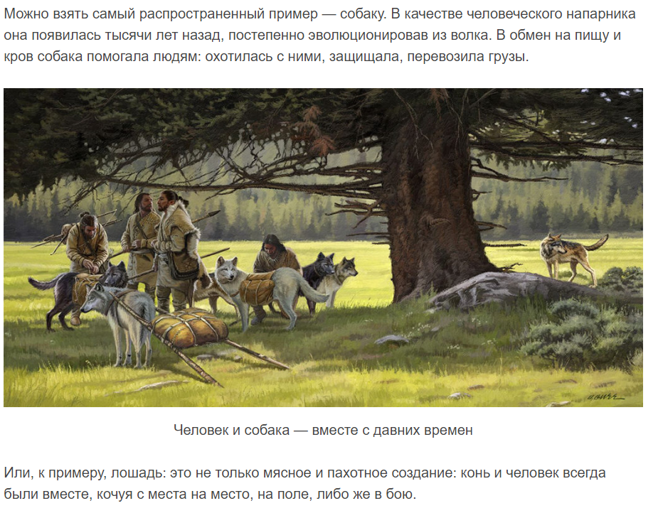
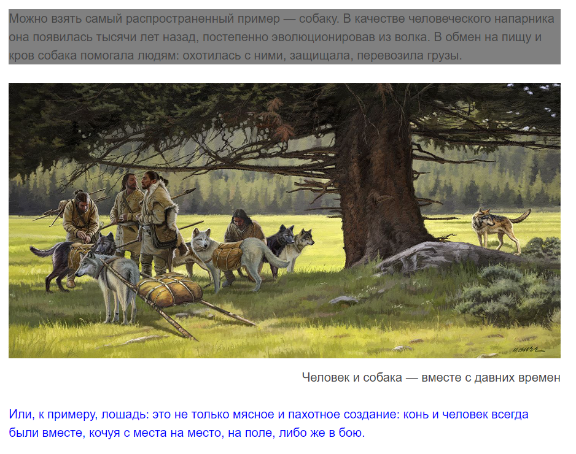
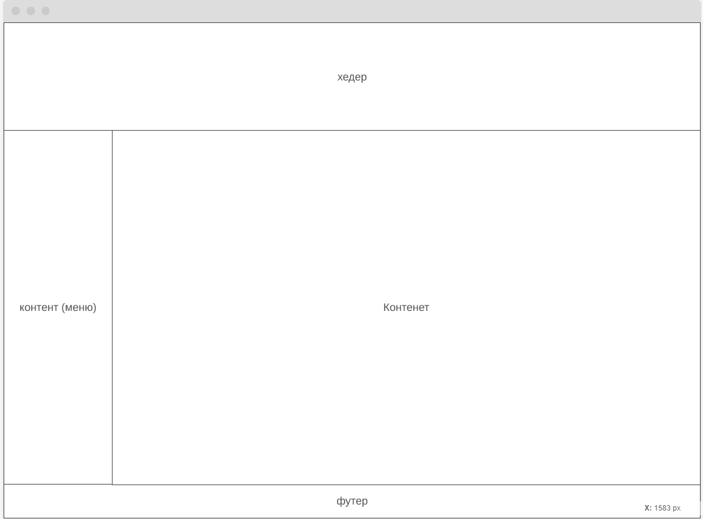

#Веб-технологии: вчера, сегодня, завтра#
- Определите, на каком протоколе работает сайт.
- Проанализируйте структуру страницы сайта. Покажите в коде где хедер, футер и контент.
- Внесите не менее 3 изменений на страницу с помощью инструмента разработчика и представьте скриншоты было/стало.
- Создайте прототип низкой детализации.

Сайт работает на протоколе https

- хедер

- футер

- контент

было:

стало:

прототип низкой детализации